# Audio Network Dissection (AND)

* This is the official repository for [ICML 2024 paper](https://arxiv.org/pdf/2406.16990): "AND: Audio Network Dissection for Interpreting Deep Acoustic Models"
  * **AND** is the first framework to describe the roles of hidden neurons in audio networks.
  * **AND** provides both **open-vocabulary concepts** and **generative natural language explainations of acoustic neurons based on LLMs**, and can seamlessly adopt progressive LLMs in the future.
  * **AND** showcases the potential use-case for **audio machine unlearning** by conducting concept-specific pruning.
  
* Below we illustrate the overview of **AND**, which consists of 3 major Modules A-C to identify neuron concepts in audio networks as illustrated below. For more information about AND, please check out our <a href="https://lilywenglab.github.io/Audio_Network_Dissection/">project website</a>.
  
<p align="center">
	
</p>

<!---
<p align="center">
	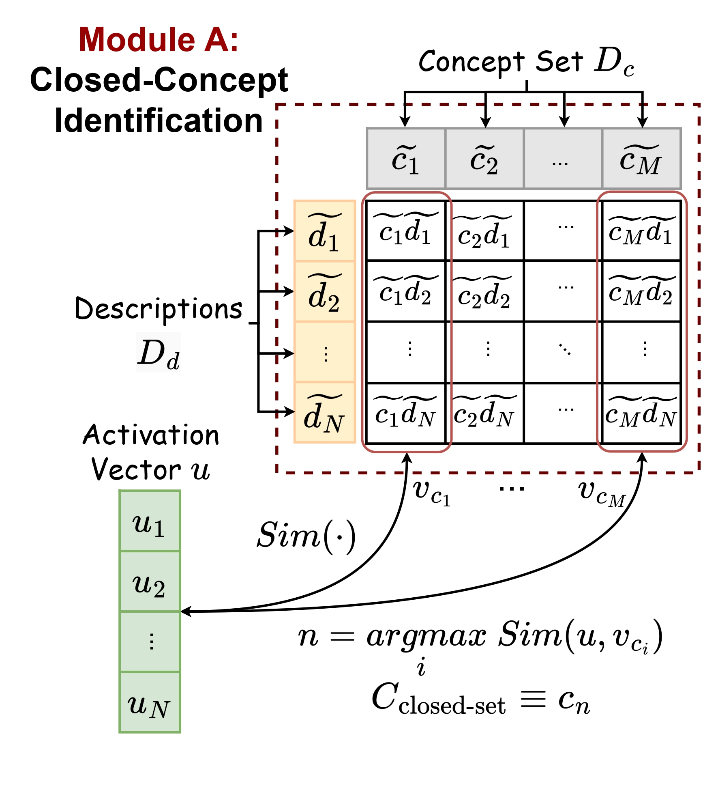
	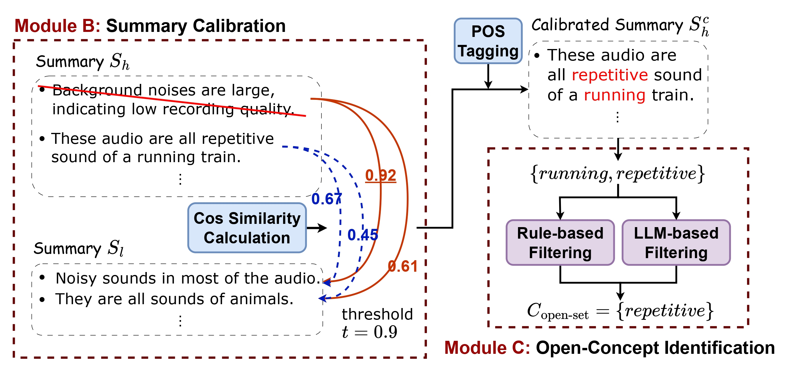
</p>

-->  

## Pipelines

### Environment
```
pip install -r requirements.txt
huggingface-cli login
python -m spacy download en_core_web_lg
```

### Preprocessing
The naming conventions for layers in AST and BEATs differ. Please refer to `args.py`.

```
python3 save_activations.py -tn <target_model_name> -tl <target_layers>
python3 save_discriminative_sample.py  -tn <target_model_name> -tl <target_layers>
```

1. Download BEATs checkpoints and change path in `data_utils.py`: https://drive.google.com/drive/folders/1FBIOj0ZMyPMbVFeQkInX-DYi0XBozOYS?usp=drive_link

2. Download processed file and place them into these directories. As preprocessing takes time, we provided processed file in following google drive, then you can skip <br>Summary Calibration and Open-concept Identification</br> part and run subsequent experiments:

summaries: https://drive.google.com/drive/folders/1eTF-X1nxhuhsWeys4kxbvzgLpavVmvrj?usp=drive_link

prediction: https://drive.google.com/drive/folders/11kfcToeiNbltPESzVvU5IVQpizdkxbwK?usp=drive_link

### Closed-concept Identification
```
cd closed_concept_identification

python3 DB.py -tn <target_model_name> -tl fc
python3 TAB.py -tn <target_model_name> -tl fc
python3 ICL.py -tn <target_model_name> -tl fc
```

### Summary Calibration and Open-concept Identification
```
cd summaries

python3 generate_summary.py -tl <target_layers> -dt highly
python3 generate_summary.py -tl <target_layers> -dt lowly
python3 summary_calibration.py -tn <target_model_name>
```

### Pruning

```
cd pruning

python3 close_neuron_class.py -tn <target_model_name> -tl <target_layers> -ps <pruning_strategy>
python3 evaluation_confidence.py -tn <target_model_name> -tl <target_layers> -ps <pruning_strategy>

python3 close_neuron_class.py -tn <target_model_name> -tl <target_layers> -ps <pruning_strategy> -pc <list_of_pruned_concepts>
python3 evaluation_confidence.py -tn <target_model_name> -tl <target_layers> -ps <pruning_strategy> -pc <list_of_pruned_concepts>
```

### Interpretability
```
cd interpretability

python3 clustering.py
python3 plot-uninterpretable-neuron.py -tn <target_model_name>
```

## Experiment Results
For setting details and implications of each Table/Figure, please refer to <a href="https://arxiv.org/pdf/2406.16990">our paper</a>. Due to the randomness of Large Language Models, the figures may be slightly different from those presented in our paper. However, this does not affect our findings.

### AST's Adjective Distribution
* Experiments in `experiments/fig3_9_adjective_distribution.ipynb`, corresponding to Fig. 3 in Sec. 3.5
<p align="center">
	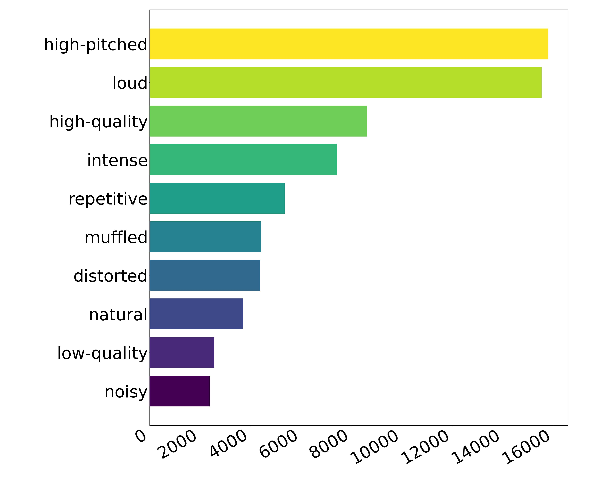
</p>

### Last Layer Dissection Accuracy 
* Experiments in `experiments/table4_confidence_drop_after_pruning.ipynb`, corresponding to Table 2 in Sec.4.1
<p align="center">
	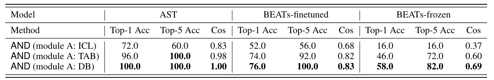
</p>

### Confidence Drop after Pruning
* Experiments in `experiments/table4_confidence_drop_after_pruning.ipynb`, corresponding to Table 4 in Sec. 4.3
<p align="center">
	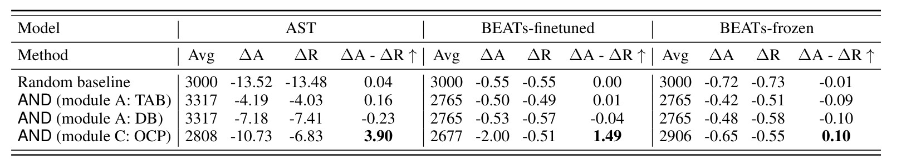
</p>

* Experiments in `experiments/fig10_confidence_drop_after_pruning.ipynb`, corresponding to Fig. 10 in Appendix F
<p align="center">
	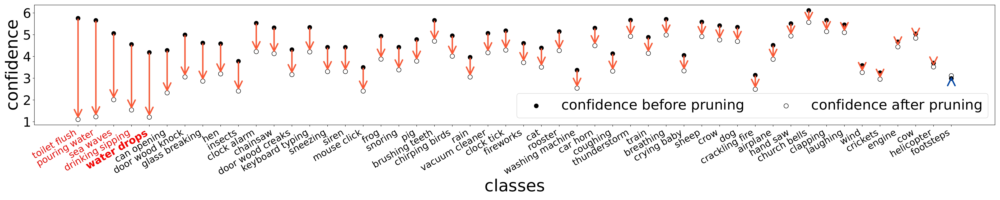
</p>

### Acoustic Feature Importance
* Experiments in `experiments/fig4_milan_experiments.ipynb`, corresponding to Fig. 4 in Sec. 4.4
<p align="center">
  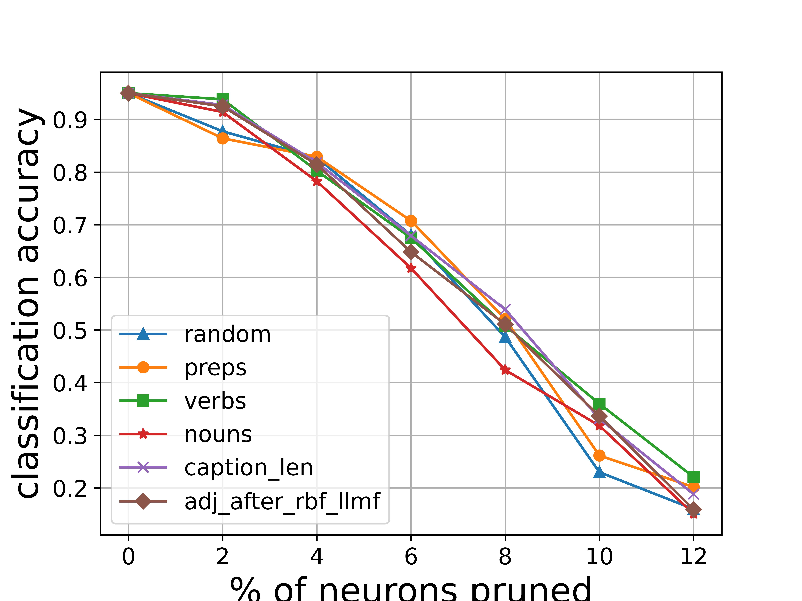
  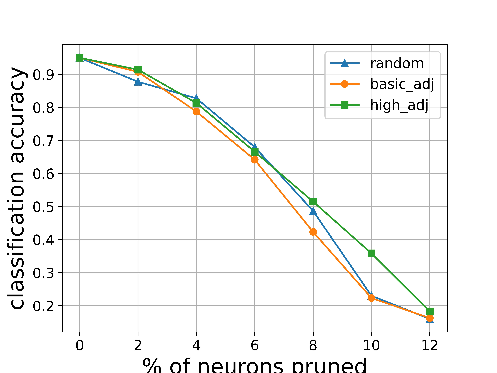
  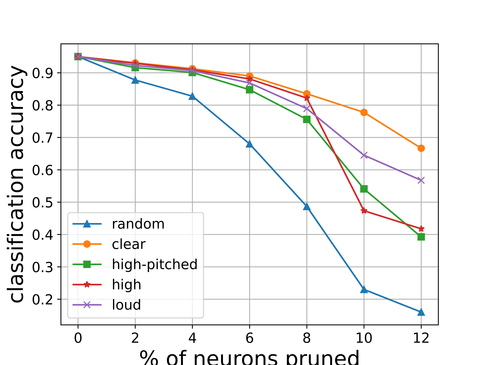
</p>

### Number of Avg. Adjective per Layer
* Experiments in `experiments/fig5_adj_per_layer.ipynb`, corresponding to Fig. 5 in Sec. 4.4
<p align="center">
	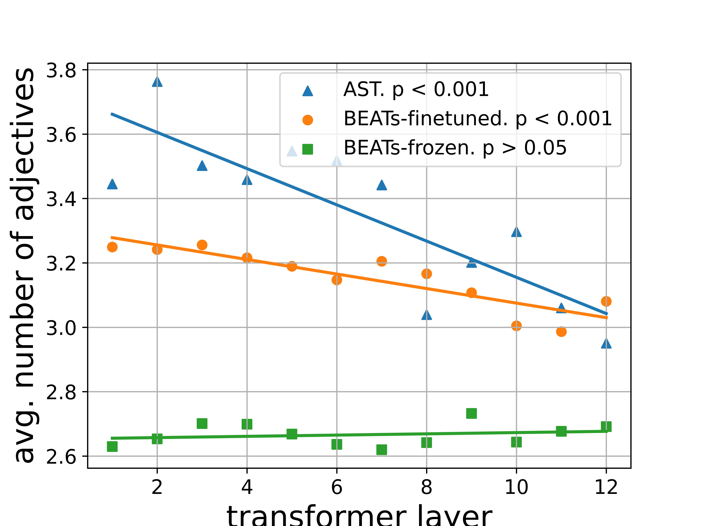
</p>

### Neuron Interpretability 
* Experiments in `experiments/fig6_11_12_13_14_uninterpretable_neurons.ipynb`, corresponding to Figure 6 in Sec. 4.5
<p align="center">
	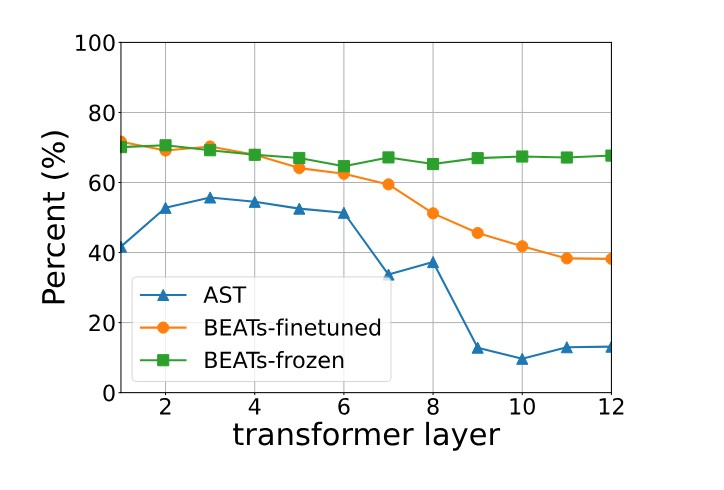
</p>

Note that the numbers might be slightly different due to randomness of the LLM's output or code refactoring. While the changes should be small.

## Sources:
* CLIP-Dissect: https://github.com/Trustworthy-ML-Lab/CLIP-dissect
* SALMONN: https://github.com/bytedance/SALMONN
* Llama-2: https://huggingface.co/meta-llama/Llama-2-13b-chat-hf
* CLAP: https://github.com/LAION-AI/CLAP
* BEATs: https://github.com/microsoft/unilm/tree/master/beats

## Cite this work
T.-Y. Wu<sup>1</sup>, Y.-X. Lin<sup>1</sup>, and T.-W. Weng, "AND: Audio Network Dissection for Interpreting Deep Acoustic Models", ICML 2024.

```
    @inproceedings{AND,
        title={AND: Audio Network Dissection for Interpreting Deep Acoustic Models},
        author={Tung-Yu Wu, Yu-Xiang Lin, and Tsui-Wei Weng},
        booktitle={Proceedings of International Conference on Machine Learning (ICML)},
        year={2024}
    }
```
