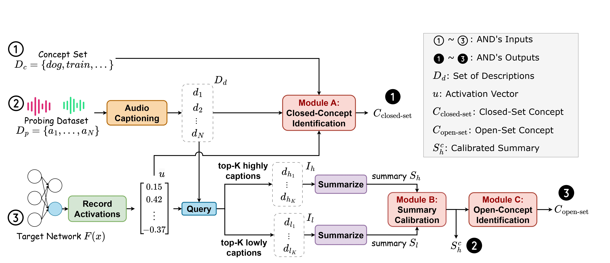
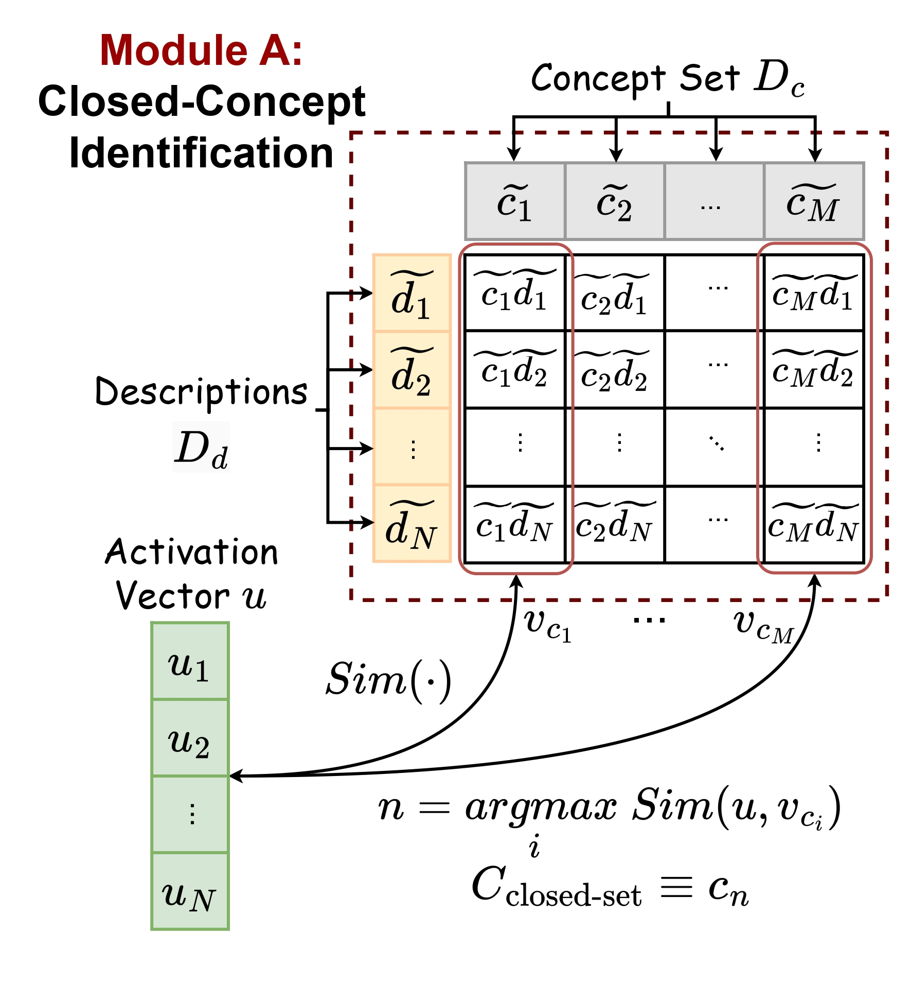
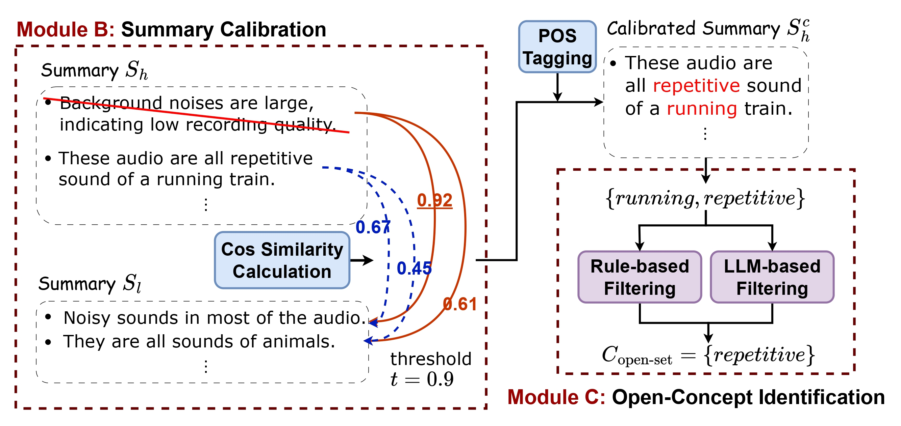

# Audio Network Dissection (AND)

* This is the official repository for [ICML 2024 paper](https://arxiv.org/pdf/2406.16990): "AND: Audio Network Dissection for Interpreting Deep Acoustic Models"
  * **AND** is the first framework to describe the roles of hidden neurons in audio networks.
  * **AND** provides both **open-vocabulary concepts** and **generative natural language explainations of acoustic neurons based on LLMs**, and can seamlessly adopt progressive LLMs in the future.
  * **AND** showcases the potential use-case for **audio machine unlearning** by conducting concept-specific pruning.
  
* Below we illustrate the overview of **AND**, which consists of 3 major Modules A-C to identify neuron concepts in audio networks as illustrated below. For more information about AND, please check out our <a href="https://lilywenglab.github.io/Audio_Network_Dissection/">project website</a>.
  
<p align="center">
	
</p>

<!---
<p align="center">
	
	
</p>

-->  


## Sources:
* CLIP-Dissect: https://github.com/Trustworthy-ML-Lab/CLIP-dissect
* SALMONN: https://github.com/bytedance/SALMONN
* Llama-2: https://huggingface.co/meta-llama/Llama-2-13b-chat-hf
* CLAP: https://github.com/LAION-AI/CLAP


## Cite this work
T.-Y. Wu<sup>1</sup>, Y.-X. Lin<sup>1</sup>, and T.-W. Weng, "[AND: Audio Network Dissection for Interpreting Deep Acoustic Models](https://arxiv.org/pdf/2406.16990)", ICML 2024.

```
  @inproceedings{AND,
      title={AND: Audio Network Dissection for Interpreting Deep Acoustic Models},
      author={Tung-Yu Wu, Yu-Xiang Lin, and Tsui-Wei Weng},
      booktitle={Proceedings of International Conference on Machine Learning (ICML)},
      year={2024}
  }
```
